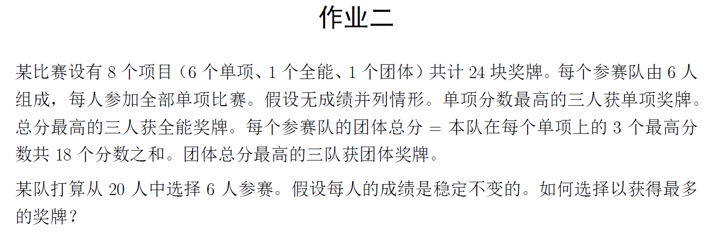

### 数学建模第二次作业

本次作业是为了解决如下问题：

#### 文件包含：

- ##### main：主程序，用于计算并输出

- ##### CCT：用于计算的类模块，不依赖于主程序设置的参数

- ##### RandomGenerate：生成随机测试数据，保存在CSV文件之中

- ##### testdata.csv：输入数据，为全排名列表

- ##### TestLogs.xlsx：一些测试记录

#### 使用方法：

- 在`testdata,csv`中输入全排名列表，也可以直接通过`RandomGenerate.py`生成随机数据，其中参数N为除目标队伍外的队伍数量
- 启动主程序`main.py`，待其运行完毕
- 最后输出的结果保存在`results.txt`文件中
